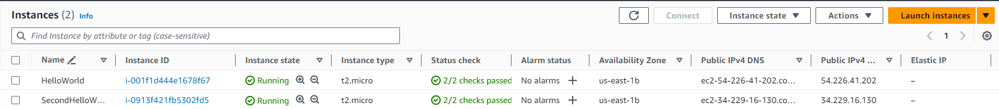

# Taller 7: APLICACIÓN DISTRIBUIDA SEGURA EN TODOS SUS FRENTES
**Estudiante:** Edwar Fabian Lozano Florez  
**Clase:** AREP  
**Profesor:** Luis Daniel Benavides

## Arquitectura


## Cómo funciona

1. Debe clonar el proyecto haciendo uso del comando:
```
git clone https://github.com/EdwarLozano/Taller7-AREP.git
```

2. Se crearon 2 instancias en AWS:

3. Nos conectamos a cada una de ellas e instalamos java, git y maven:
```
//Conexión primera instancia
ssh -i HelloWorldKP.pem ec2-user@54.226.41.202

//Conexión segunda instancia
ssh -i HelloWorldKP.pem ec2-user@34.229.16.130

//Instalamos java
sudo yum install java-17-amazon-corretto-devel

//Instalamos git
sudo su
yum install git -y

//Instalamos Maven
sudo yum install maven -y
```

4. Clonamos el proyecto en cada máquina:
```
git clone https://github.com/EdwarLozano/Taller7-AREP.git
```

5. Corremos el proyecto en cada máquina
```
java -cp target/classes:target/dependency/* co.edu.eci.arep.securespark.HelloWorld
```

6. Podemos acceder a la aplicación usando el link de aws de la máquina:
- https://ec2-54-226-41-202.compute-1.amazonaws.com:5000/hello
- https://ec2-34-229-16-130.compute-1.amazonaws.com:9000/hello


## Información Adicional
- Generación de las llaves (Se necesitan 2)

```
keytool -genkeypair -alias ecikeypair -keyalg RSA -keysize 2048 -storetype PKCS12 -keystore ecikeystore2.p12 -validity 3650 
keytool -storetype PKCS12 -export -keystore ./ecikeystore2.p12 -alias ecikeypair -file ecicert2.cer 
keytool -storetype PKCS12 -import -file ../certificates/ecicert2.cer -alias firstCA -keystore myTrustStore1.p12
```


## Requisitos
- Java: Ambiente de desarrollo
- Maven: Administrador del ciclo de vida del Proyecto
- Git: Controlador de versiones
- AWS: Para la creación de las instancias

## Construido con

IntelliJ IDEA 2022.3.2 (Community Edition)
